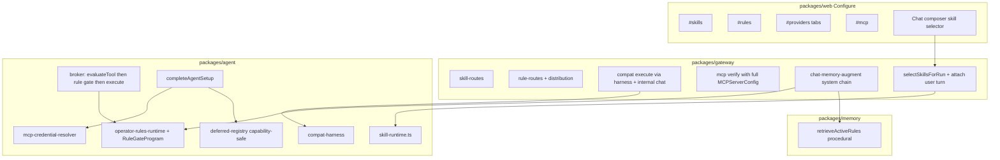
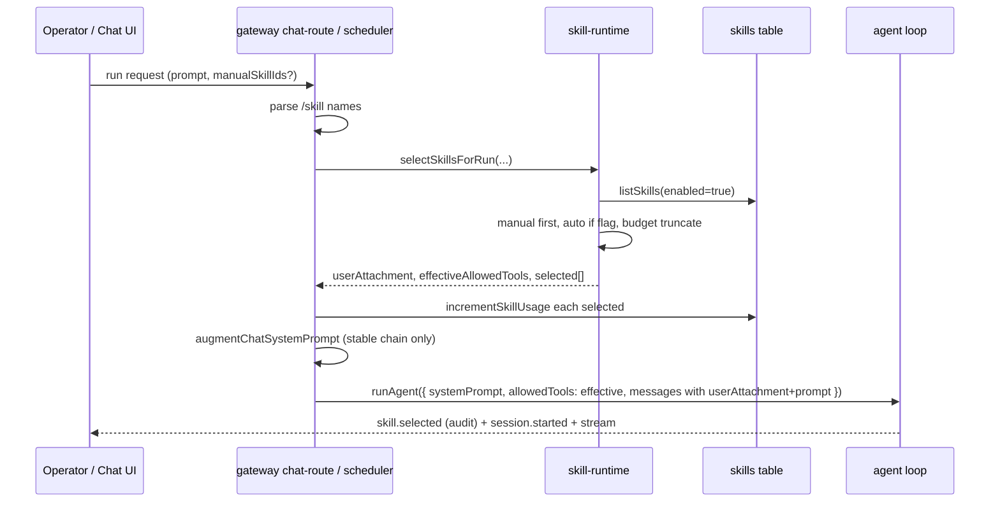
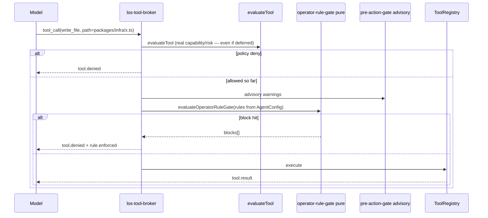

# los Configure-surface P0/P1：Skills runtime / Rules enforcement / Providers daily path / MCP credentials

| Field | Value |
| --- | --- |
| **Title** | Configure-surface P0/P1: Skills runtime, Rules enforcement, Providers daily path, MCP credentials + deferred tools |
| **Author** | Design draft for operator review (los configure-surface owners: agent + gateway + web) |
| **Date** | 2026-08-08 |
| **Status** | Draft (rev 2 — post design review) |
| **Revision** | 2 |
| **Repo** | `/Users/echerlos/projects/los-workspace/projects/los` |
| **Related contracts** | `contracts/skill-mcp-distribution.yaml` (target 0.3.0 after PR5) |
| **Related ADRs / governance** | ADR 0020, ADR 0030, ADR 0033 (sketch only); AP11 / `docs/governance/code-first-determinism.md` |
| **Primary surfaces** | `#providers`, `#skills`, `#rules`, `#mcp` |
| **Tracking** | Configure-surface P0/P1 design; implement via PR Plan below |

---

## Overview

los 的 Configure 四页（Providers / Skills / Rules / MCP）已经具备 **注册表 CRUD + 部分 distribution lifecycle**，但存在可验证的“产品谎言”：

1. **Skills** 是 registry-only：`runMode`、`usageCount`、`description` 写进了 UI 和表，却没有进入 agent loop 的真实调用路径；`incrementSkillUsage()` 从未被调用。
2. **Rules** 存在双系统：Operator Rules 表（`#rules`）可 CRUD 但 **不注入 runtime**；Memory procedural rules 通过 `chat-memory-augment` **会注入**。UI 没有把两者标清，也没有 pin/history/inspect-before-apply。
3. **Providers** 的 daily path 仍偏 CLI：compat 证据存在，但 UI 只展示 badge + CLI hint；account adopt 仍是 Grok-only；promotion decisions API 存在但 UI 弱。
4. **MCP** 是四页中最完整的（inspect→apply→verify→enable、pin/rollback、`completeAgentSetup` 已接线），但 `credential_ref`/`oauth` fail-closed 且无 resolver；verify 结果是 JSON dump；**verify 路径仍是 stdio-shaped**（`new MCPClient({ command })`），尽管 `mcpServerExecutionBlocker` 已不再因 transport≠stdio 而拦截；contract 仍写 SSE/HTTP fail-closed。

本设计关闭 **P0 产品谎言**，并交付 **P1** credential resolver、**capability-safe** deferred tool loading、Providers IA、Rules distribution 对齐与 contract 纠偏。原则：contract-first、fail-closed 安全默认、**AP11 prompt-cache 友好**、最小可合并 PR 栈、复用现有表，避免新的巨型 store。

**Rev 2 相对 rev 1 的关键纠正**：Skills 不进可变 system prefix（user-turn attachment + AP11 门禁）；auto 默认 OFF；MCP deferred 必须先修 `evaluateTool` 能力泄漏再默认开启；remote MCP 先修 verify 再改 contract；Providers compat 走 gateway internal harness 而非“提取 CLI”；rule DSL 使用真实 registry 工具名；ConfigSchema 显式建模 flags。

---

## Background & Motivation

### 当前状态（已在代码中核实）

| 表面 | 存储 / API | Runtime 接线 | 产品缺口 |
| --- | --- | --- | --- |
| Skills | `skills` + `skill_versions`；`/skills/*` + import inspect/apply | **无**（仅 seed + HTTP） | runMode/usage 是死字段 |
| Operator Rules | `rules`；`/rules/*` + load/sync dir | **无** | severity/enforcement 不生效 |
| Procedural Rules | `procedural_candidates` / compaction JSONB | **有**（`retrieveActiveRules` → `formatRulesForPrompt` → `augmentSystemPrompt`） | 与 Operator Rules 混淆 |
| MCP | `mcp_servers` + versions；inspect/apply/verify/enable | **有**（setup → blocker → registerBuiltinTools） | credential_ref 无 resolver；verify 仅 stdio client 构造；verify UI 弱 |
| Providers | config discovery + `provider_accounts` + compat evidence + promotion decisions | 部分（account adopt Grok-only；compat 靠 CLI→HTTP `/chat`） | one-click compat 缺失；IA 扁平 |

关键代码锚点：

- `packages/agent/src/skills.ts`（~531 行，已超 500 警告门）— `incrementSkillUsage()` 存在；`parseSkillMarkdown` key 正则 `^(\w+):` **不接受 hyphenated Claude keys**
- `packages/agent/src/rules.ts` — Operator rules CRUD；**无 version 表**
- `packages/memory/src/core/retrieval.ts` — procedural 标题固定 `## Active Procedural Rules`
- `packages/gateway/src/chat-memory-augment.ts` — `identity → base → procedural → observations`
- `packages/agent/src/pre-action-gate.ts` + `los-tool-broker.ts` — pre-action **仅 warn**；`evaluateTool` 决定 allow
- `packages/agent/src/tools/core/deferred-registry.ts` — 包装**整个** registry；`evaluateTool` 对未 materialize 条目硬编码 `allowed: true, riskLevel: 'L0'`（**安全缺陷**）
- `packages/gateway/src/routes/tools/mcp-routes.ts` — `verifyRegisteredServer`：`new MCPClient({ command: server.command!, args, env })`，**无 transport/url/headers**
- `packages/agent/src/tools/external/mcp-client.ts` — `registryRecordToConfig` 已支持 url+transport；runtime bridge 可用
- `packages/cli/src/compat.ts` — CLI 是 **HTTP 客户端**（`POST ${gateway}/chat` + SSE），证据写入用 `@los/agent` recorder；shared specs 在 `compat-harness.ts`
- `packages/agent/src/system-prompt-version.ts` — `SYSTEM_PROMPT_VERSION = '1.3.1'`（AP11 门禁）
- `packages/infra/src/config.ts` — `ConfigSchema.agent` **无** skills/rules/deferred 字段
- `contracts/skill-mcp-distribution.yaml` — SSE / streamableHttp / credentialRef 仍 fail-closed

### 痛点

1. 操作员启用 skill / `runMode=auto` 后 agent 行为不变 → 信任崩溃。
2. `severity=block` + `required` 不拦截 tool → 安全谎言。
3. Providers 只给 CLI hint，web-first 无法完成 daily 验证。
4. MCP `credential_ref` 可录入但永远失败；contract 与 blocker/verify 三方漂移。

---

## Goals & Non-Goals

### Goals

**P0（必须关闭产品谎言）**

- **P0-1 Skills runtime**（**los-owned runAgent 入口共用选择 helper**；P0 必须接线 **gateway chat + scheduler/work 主路径**；UI 不得只写 “Chat only” 若 scheduler 已接）  
  - manual invoke（Chat 选择器 + `/skill`）  
  - auto 相关性（**默认 OFF**，bounded）  
  - 真实 `incrementSkillUsage`  
  - frontmatter 子集 + **AP11 合规放置**
- **P0-2 Rules dual-system fix**：注入 active operator rules + required/block 可测试 hard gate；procedural 明确 learned
- **P0-3 Providers daily path**：Providers 页 one-click compat（**gateway internal harness path**）；promotion/evidence 可读；Grok-only account 策略明确 + discovery/config 标签

**P1**

- **P1-1** MCP `credential_ref` 最小 resolver（env/local-file；fail-closed；响应无 raw secrets）
- **P1-2** MCP deferred tool loading — **仅在 capability-safe registry 修复后**；默认 OFF 直到修复合入
- **P1-3** Providers 页 IA：Account | Endpoints | Routes | Evidence tabs
- **P1-4** MCP verify 结果产品化（tool table + blockers）
- **P1-5** Rules inspect-before-apply（含 load-from-dir 兼容迁移）
- **P1-6** Contract/doc 同步 — **仅在 remote verify 真实可用之后** 声明 SSE/HTTP supported

### Non-Goals

- Full MCP marketplace / skill marketplace / cloud catalog
- 完整 ADR 0033 provider/tool hot reload
- OAuth full MCP flow
- Multi-tenant SaaS skill sharing
- Hermes-style 巨型 provider store
- 改变 AP1/AP2/AP3 run 状态机语义
- 把 CLI HTTP/SSE 客户端逻辑下沉进 `@los/agent`（会反转包边界）

---

## Key Decisions

| # | Decision | Rationale |
| --- | --- | --- |
| KD1 | Skills 内容放在 **user-turn attachment**（或 system 消息中 **stable prefix 之后的 documented cache breakpoint 之后**），**不得**写入 per-request 可变的 system prefix 前部 | AP11 / prefix cache；见 §2.0 与 A6 |
| KD2 | Manual skill：Chat 选择器 + `/skill <name>`（gateway 解析） | 关闭产品谎言的最小路径；与 Claude slash 心智一致 |
| KD3 | Auto skill：**默认 OFF**（`LOS_SKILLS_AUTO=0`）；开启后仅 `enabled && runMode=auto && !disableModelInvocation` 参与 description 打分；硬上限 maxSkills + maxTokens | 降低 day-one cache/成本脚枪；manual 默认 ON 足以关闭“完全不生效”谎言 |
| KD4 | Operator rules **注入 + 强制**：`required` + `severity=block` + valid match → broker **hard deny** | 产品正确性；无 match DSL 的 block 只注入不 enforce |
| KD5 | 合成顺序：`identity → base → operator rules → learned procedural → observations` 为 **stable-ish system chain**；**Active Skills 作为 user-turn 附件**（不插入 system 前缀中部） | 操作员政策优先；skills 变动不打碎 identity/base cache |
| KD6 | Procedural 标题改为 `## Learned Procedural Rules (memory)`；Operator 为 `## Operator Rules` | 消除双系统混淆 |
| KD7 | Providers one-click：gateway 用 `createCompatibilityRunSpecs` + **进程内 chat/run 调度** + 现有 evidence recorder；CLI 保持 thin HTTP client | 正确包边界；不把 CLI fetch/SSE 抽进 agent |
| KD8 | Account band：**有意 Grok-only adopt**；补 key/env 引导与 discovery-vs-config 标签 | ADR 0030 Phase 1A |
| KD9 | MCP `credential_ref` 使用与 `provider_accounts.secretRef` **相同** `isApprovedSecretRef` 正则；stdio→env，remote→headers | 安全一致；fail-closed |
| KD10 | MCP deferred：**禁止**在当前 all-or-nothing + L0 bypass 上默认开启；先修 registry 分层 + `evaluateTool` 返回真实 capability；修完后默认仍 **OFF**，flag 显式开启 | 安全优先 |
| KD11 | SSE/HTTP：**execution blocker 允许 remote ≠ verify 可用**。Contract 仅在 verify 使用完整 `MCPServerConfig`（含 resolved headers）且测试通过后声明 supported | 消除第三重谎言 |
| KD12 | Rules distribution：`rule_versions` + inspect/apply；`load-from-dir` 一版兼容写路径 | 不 silent break UI |
| KD13 | Feature flags：**必须**进 `ConfigSchema` + `config-sources.ts` env map（方案 a），禁止纯 wishful env | 可运维 / doctor 可见 |
| KD14 | 无新 package；新逻辑进新文件；`skills.ts` 只做最小 parser 改动 | 文件大小门 + 边界 |
| KD15 | Skill `allowedTools`：多 skill **交集**，再与 session `resolveAllowedTools(toolMode)` 求交；经 `AgentConfig.allowedTools` 传入 setup | 真实控制面，非 prompt 建议 |
| KD16 | Operator gate：`AgentConfig.operatorRulesGate` 一次加载；broker 只跑纯函数，**禁止** per-tool DB | 热路径预算 AP11 §3 |
| KD17 | P0 skills 接线范围：共享 `selectSkillsForRun`；**gateway chat + scheduler/work 主路径必须接线**；spawn child 继承 parent 已选 skill ids（不再 auto 扩展，除非 child config 显式允许） | 避免“仅 Chat 生效”半谎言 |

---

## Proposed Design

### 1. 架构总览



---

### 2. P0-1 Skills runtime

#### 2.0 AP11 / prompt-cache strategy（blocking）

**问题**：若把 per-run 可变的 skill 正文写入 system prompt 前缀，会整段失效 provider prefix cache（AP11 / `code-first-determinism.md`）。

**选定策略（A6 结论）**：

| Layer | Placement | Stability |
| --- | --- | --- |
| identity + base + operator rules + learned procedural + observations | system prompt（现有 `augmentChatSystemPrompt` 链，operator 段新增） | 相对稳定（同 project/session 政策变化频率低） |
| **Active Skills** | **user-turn attachment**：在用户消息前追加独立 block，或作为 messages 数组中紧挨 user 的额外 `role:user`/`role:system` **suffix message after cache breakpoint** | 高变（manual/auto 每请求不同） |

推荐实现（二选一，PR1 锁定一种并测 cache）：

1. **Preferred**：`messages = [system(stable), ...history, user(skillBlock + "\n\n" + userText)]`  
2. **Alt**：`messages = [system(stable), system(skills) /* marked ephemeral */, user(text)]` — 仅当 provider 支持 suffix/ephemeral 语义时；否则退回 (1)

**AP11 PR1 强制清单**（acceptance 不可缺）：

1. Prompt-cache impact assessment 写在 PR 描述（stable prefix token 估计 vs skills 可变段）  
2. Focused harness：manual skill 注入后关键行为路径不退化  
3. Bump `SYSTEM_PROMPT_VERSION`（operator rules 段若同 PR 改 system 链也算；skills 仅 user 附件时仍评估 context strategy；若 system 模板字符串变更必须 bump）  
4. Flag rollback：`agent.skills.runtimeEnabled=false` 立即去掉 attachment  

**Defaults**：

| Flag | Default | Reason |
| --- | --- | --- |
| `agent.skills.runtimeEnabled` | **true** | 关闭“完全不生效”谎言（manual） |
| `agent.skills.autoInject` | **false** | 等 cache/ harness 证据后再开 |
| `agent.skills.maxAutoSkills` | 3 | bound |
| `agent.skills.maxSkillTokens` | 2500 | advisory estimate bound |

#### 2.1 数据模型（优先 metadata）

**表不变主键**：`skills`、`skill_versions`。

| Field | Storage | Semantics |
| --- | --- | --- |
| `description` | column | auto 相关性主信号 |
| `runMode` | column | `auto` \| `manual` |
| `disableModelInvocation` | metadata bool | true ⇒ 永不 auto |
| `allowedTools` | metadata `string[]` | 与 session allowlist **求交**（见 §2.8） |
| `paths` | metadata `string[]` | glob；auto 候选过滤 |
| `userInvocable` | metadata bool default true | Chat 选择器 / `/skill` 菜单 |

#### 2.1.1 Frontmatter parser（Issue 12）

当前 `parseSkillMarkdown` 使用 `^(\w+):\s*(.+)$`，**无法**解析 `disable-model-invocation` 等 kebab-case。

**必须改**：

- Key tokenizer：`^([\w-]+):\s*(.+)$`
- Normalization map：

| Frontmatter key | Canonical |
| --- | --- |
| `disable-model-invocation` / `disableModelInvocation` | metadata.disableModelInvocation |
| `allowed-tools` / `allowedTools` | metadata.allowedTools |
| `user-invocable` / `userInvocable` | metadata.userInvocable |
| `paths` | metadata.paths |
| `runMode` / `run-mode` | column runMode |
| `description` | column description |

- **数组语法（v1）**：优先 JSON 数组 `["read_file","write_file"]`；否则 comma-separated `read_file, write_file`  
- 实现放在 `skill-frontmatter.ts`（新文件），`skills.ts` 只调用，避免 531 行文件继续膨胀（Issue 18）

#### 2.2 `skill-runtime.ts`

```ts
export interface SkillSelectionInput {
  prompt: string;
  workspaceRoot?: string;
  projectId?: string;
  tenantId?: string;
  manualSkillIds?: string[];
  maxAutoSkills?: number;       // default 3
  maxSkillTokens?: number;      // default 2500
  autoEnabled?: boolean;        // default from config, ship false
}

export interface SkillSelectionResult {
  selected: Array<{
    id: string;
    name: string;
    scope: 'global' | 'project';
    mode: 'manual' | 'auto';
    versionHash: string;
    tokenEstimate: number;
    allowedTools?: string[];
  }>;
  skipped: Array<{ name: string; reason: string }>;
  /** User-turn attachment text (NOT system prefix) */
  userAttachment: string;
  /** Merged allowlist restriction; undefined = no extra restriction */
  effectiveAllowedTools?: string[];
}

/** Single estimate used by auto and manual budgeting */
export function estimateSkillTokens(content: string): number {
  // Advisory only: ceil(utf8Bytes / 4). Not provider-accurate.
  // Same function for manual + auto so behavior is testable.
  return Math.ceil(Buffer.byteLength(content, 'utf8') / 4);
}
```

**Budget 语义（Issue 14）**：

1. Manual skills 先入选（操作员显式意图）。  
2. 累计 `tokenEstimate`；超出 `maxSkillTokens` 时：**truncate 后续 skill**（含多余 manual），写入 `skipped[{reason:'budget'}]`，**不**整单 chat 失败。  
3. 例外：若 **仅有一个 manual skill** 且其单独已超 budget → 仍注入但截断 content 到 budget 并 `skipped` 记 `truncated`（保证 manual 路径“有反馈”而非静默丢弃）。  
4. Auto 仅填充剩余 budget。

**相关性**：确定性 token overlap（description/name/tags/category）；`paths` 不匹配 → score 0。

#### 2.3 注入点与路径覆盖（Issue 10）

| Path | Required in P0? | Behavior |
| --- | --- | --- |
| Gateway chat | **Yes** | select → user attachment + `AgentConfig.allowedTools` merge + usage++ |
| Scheduler / work / task runner | **Yes** | 同一 `selectSkillsForRun`；prompt = task prompt；manual ids 可来自 run metadata |
| Direct `runAgent` tests/harness | Optional | 可显式传 `skillSelection` |
| Spawn child | Inherit | parent 传入 `selectedSkillIds`；默认不再跑 auto |

共享 helper 放在 `@los/agent/skill-runtime`；gateway 与 scheduler **都 import**。UI 文案：`Runtime: wired for Chat and scheduled work`（仅当两边都接上后显示）。

#### 2.4 Usage 与事件

注入成功后 `incrementSkillUsage(name, scope)` 每 skill 每 run 一次。

Session event（`type` 为 **open string**，见 `SessionEventRecord.type: string`）：

```ts
// type: 'skill.selected' — visibility: audit
// extend sessionEventVisibility() to classify skill.* as audit
payload: {
  skills: Array<{ name: string; mode: 'manual'|'auto'; versionHash: string; tokenEstimate: number }>;
  skipped: Array<{ name: string; reason: string }>;
  placement: 'user_attachment';
}
```

#### 2.5 Sequence：Skill invoke



#### 2.6 Chat UI

- multi-select skill chips（`userInvocable`）  
- `#skills`：Runtime 状态绑定 lastUsed/usageCount；说明 auto 默认关  

#### 2.7 Feature flags — ConfigSchema（Issue 8）

必须在 PR1 扩展：

```ts
// packages/infra/src/config.ts ConfigSchema.agent 扩展
skills: z.object({
  runtimeEnabled: z.coerce.boolean().default(true),
  autoInject: z.coerce.boolean().default(false),
  maxAutoSkills: z.coerce.number().int().positive().max(20).default(3),
  maxSkillTokens: z.coerce.number().int().positive().default(2500),
}).default({}),
```

Env map（`config-sources.ts`）：

| Env | Config path | Default |
| --- | --- | --- |
| `LOS_SKILLS_RUNTIME` | `agent.skills.runtimeEnabled` | true |
| `LOS_SKILLS_AUTO` | `agent.skills.autoInject` | false |
| `LOS_SKILLS_MAX_AUTO` | `agent.skills.maxAutoSkills` | 3 |
| `LOS_SKILLS_MAX_TOKENS` | `agent.skills.maxSkillTokens` | 2500 |

#### 2.8 `allowedTools` 真实控制面（Issue 5）

**Merge 语义**：

```
sessionAllow = resolveAllowedTools(config.allowedTools, toolMode, ...)
skillLists = selected.map(s => s.allowedTools).filter(list => list && list.length > 0)
if skillLists.length === 0:
  effective = sessionAllow  // no extra restriction
else:
  effective = intersection(sessionAllow ?? ALL_REGISTERED, ...skillLists)
```

- 空 `allowedTools` metadata = 该 skill 不增加限制  
- 多 skill 全部声明时取 **交集**（最紧）  
- Thread：gateway/scheduler 构建 `AgentConfig.allowedTools = effective` **在** `setupAgentRun` 之前  
- **测试**：skill `allowedTools: ['read_file']` + toolMode `project-write` → `write_file` denied  

---

### 3. P0-2 Rules dual-system fix

#### 3.1 语义拆分

| Source | Owner | Prompt title | Enforcement |
| --- | --- | --- | --- |
| Operator Rules | `@los/agent` `rules` | `## Operator Rules` | advisory warn / required hard gate |
| Learned Procedural | `@los/memory` | `## Learned Procedural Rules (memory)` | advisory only |

#### 3.2 注入

`listActiveOperatorRules` + `formatOperatorRulesForPrompt`；在 `augmentChatSystemPrompt` 中插入 operator 段于 procedural 之前。

`ChatContextPolicyDecision` 扩展 `operatorRules: { count, requiredCount, blockCount }`。

#### 3.3 Enforcement + DSL（Issues 6–7）

**AgentConfig 扩展**：

```ts
operatorRulesGate?: {
  enabled: true;
  rules: RuleRecord[]; // preloaded, max 20
} | { enabled: false };
```

- Gateway/scheduler 在构建 run 时 **一次** `listActiveOperatorRules`，填入 config  
- Broker **禁止** DB；只调用纯函数 `evaluateOperatorRuleGate(toolName, args, rules)`  
- 在 `evaluateTool` / phase policy 之后、execute 之前调用；block → deny（与 phase deny 同路径）

**Match DSL（YAML frontmatter only）**：

```yaml
---
match:
  tools:
    - write_file
    - edit_file
    - multi_edit
    - apply_patch
    - run_shell
  pathGlobs: ["packages/infra/**", "contracts/**"]
  argRegex:
    command: "(rm -rf|git push --force)"
---
Never force-push or wipe infra without explicit operator approval.
```

**Canonical tool names（v1 exact registry names）**：

| Use in match.tools | Notes |
| --- | --- |
| `read_file` | |
| `write_file` | not `write` |
| `edit_file` | not `write_edit` |
| `multi_edit` | if registered |
| `apply_patch` | |
| `run_shell` | not `shell` |
| `list_directory` | |
| MCP tool names | exact registered name |

Optional alias map（文档 + 解析层，默认关闭）：`write`→`write_file` 等——若开启须单测；**v1 建议关闭**，UI 校验未知名。

**Path 归一化**：复用 `filePathFromToolArgs`（`file_path` | `path` | `file` | `target`）。

**Parser 失败语义**：

- `enforcementMode=required` 且 `severity=block`：invalid YAML / unknown tools → **fail closed to non-enforceable** + operator warning in UI/list API `machineEnforceable: false`（避免误杀）；同时 log audit  
- 纯文本无 match：只注入 prompt，不 hard-block  

**事件**：

```ts
// type: 'rule.enforced' — visibility: audit (extend sessionEventVisibility for rule.*)
payload: {
  ruleId: string;
  ruleName: string;
  severity: string;
  enforcementMode: string;
  action: 'block' | 'warn';
  toolName: string;
  reason: string;
}
```

#### 3.4 Sequence：Rule enforcement



#### 3.5 Rules flags（ConfigSchema）

```ts
rules: z.object({
  operatorInject: z.coerce.boolean().default(true),
  enforcementEnabled: z.coerce.boolean().default(true),
  maxPromptRules: z.coerce.number().int().positive().max(100).default(20),
}).default({}),
```

| Env | Path | Default |
| --- | --- | --- |
| `LOS_OPERATOR_RULES_INJECT` | `agent.rules.operatorInject` | true |
| `LOS_OPERATOR_RULES_ENFORCE` | `agent.rules.enforcementEnabled` | true |
| `LOS_OPERATOR_RULES_MAX` | `agent.rules.maxPromptRules` | 20 |

---

### 4. P0-3 Providers daily path

#### 4.1 One-click compat（Issue 4 — 纠正架构）

**错误做法（rev1）**：把 `packages/cli/src/compat.ts` 的 fetch/SSE 抽进 `@los/agent`。  
**正确做法**：

| Layer | Responsibility |
| --- | --- |
| `@los/agent/compat-harness` | `createCompatibilityRunSpecs`, summarize, evidence recorders（**已存在**） |
| `@los/gateway` | `POST /providers/:name/compat/execute`：operator auth → build specs → **进程内**调用与 `/chat` 相同的 run 调度（handler 抽取或内部 service），收集事件 → `recordProviderCompatEvidenceFromSummary*` → 返回 sanitized summary |
| `@los/cli` compat | **保持** thin HTTP client：`POST gateway/chat` 或可选新 route；不反向被 gateway import |

```http
POST /providers/:name/compat/execute
Authorization: operator
Body: {
  "model"?: string,
  "probe"?: string,
  "timeoutMs"?: number,
  "workspaceRoot"?: string
}
Response: {
  "ok": boolean,
  "evidenceId"?: string,
  "summary": { /* sanitized, no full transcript secrets */ },
  "cliEquivalent": "los compat --execute --target ..."
}
```

约束：

- Operator only  
- `timeoutMs` 有上界  
- `workspaceRoot` allowlist（默认 gateway workspace）  
- **依赖 live gateway agent path**（不是离线纯函数 probe）  
- 与 CLI 写入同一 `provider_compat_evidence` 表  

#### 4.2 Promotion + evidence UI

行内：`promotionState`、latest probe/decision/time、evidenceId。  
Evidence 区：`GET /providers/compat-evidence` + promotion decisions + promote/enforce 按钮。

#### 4.3 Account band

Grok-only adopt 保留；文案 Phase 1A；不可用时展示 env/API key 引导；badge：`discovery-only` | `config` | `account-bound` | `compat`（ADR 0030 不合成单一 ready）。

---

### 5. P1-1 MCP credential_ref resolver（Issue 9）

#### 5.1 Ref 校验

Inspect/apply 时 `credentialRef` 必须通过与 `provider_accounts` 相同的 approved secret ref 正则（导出 `isApprovedSecretRef` 到共享位置或在 agent 复制同一 regex——优先 **从 `@los/infra` 导出** 避免漂移）。

非法 ref → 400 at write time，不只 runtime。

#### 5.2 Resolver API

```ts
export type MCPResolvedCredential =
  | {
      ok: true;
      /** stdio child env fragment */
      env: Record<string, string>;
      /** remote transport headers (e.g. Authorization) */
      headers: Record<string, string>;
      backend: 'env' | 'local-file';
    }
  | { ok: false; reason: string };

export async function resolveMCPCredentialRef(
  auth: MCPAuthConfig,
  opts: { serverId: string; transport: MCPTransport },
): Promise<MCPResolvedCredential>;
```

**Backends v1**：

| Ref | Behavior |
| --- | --- |
| `env:VAR` | `process.env[VAR]` → stdio: `{ [VAR]: value }`；remote: default header `Authorization: Bearer <value>` unless ref metadata says otherwise |
| `local-file:los-auth/<provider-key>` | **仅允许** prefix `local-file:los-auth/`；reader 复用 xAI/local auth store 的只读解析接口（需在 PR5 抽出 `readLocalAuthSecret(ref)→string`，不存在则 fail-closed `local_file_reader_unavailable`） |
| `external:*` / `adapter:*` | fail-closed `backend_not_implemented` |
| `oauth` mode | fail-closed（non-goal） |

#### 5.3 接线

| Site | Behavior |
| --- | --- |
| verify | resolve → 构建 **完整** `MCPServerConfig`（stdio: command/args/env；remote: url/transport/headers）→ `new MCPClient(config)` |
| completeAgentSetup | resolve into in-memory registry records only |
| `mcpServerExecutionBlocker` | auth≠none 时检查 ref **shape approved**；message：`credential_ref not resolved` vs `unsupported auth mode`；enable 仍要求 status=connected（verify 成功后） |
| public API | 永不返回 env values / headers values；仅 `envKeys` + opaque `credentialRef` |

#### 5.4 Contract 更新时机

**仅当** §6 verify transport 修复 + 测试通过后，yaml 才写：

```yaml
credentialRef: supported for env: and local-file:los-auth/* after verify+enable; otherwise fail-closed
sse: supported after verify+enable when url present and auth resolved
streamableHttp: supported after verify+enable when url present and auth resolved
```

在此之前 contract 可写：`remote verify: implementing` 或保持 fail-closed 并加注释 “blocker allows; verify incomplete”——**禁止**声称 supported 而 verify 仍 command-only。

---

### 6. P1-2 MCP deferred tools — capability-safe redesign（Issue 2）

#### 6.1 现状缺陷（blocking）

`createDeferredRegistry`：

1. 在 `setupAgentRun` 包装 **整个** registry，随后 `registerBuiltinTools` 全部走 deferred。  
2. `evaluateTool` 对未 materialize 条目返回 `allowed: true, riskLevel: 'L0', permissions: []`。  
3. Broker 在 execute **之前** 调 `evaluateTool` → MCP L1/L2 与 deny policy **被绕过**。

#### 6.2 目标架构

```text
inner Registry  ← builtins 直接 register（full schema + real capability）
     ↑
MCP Deferred layer  ← 仅 MCP tools：
  - register 时存储 fullDef + handler + **完整 capability**（含 riskLevel/permissions）
  - getDefinitions() → name-only schema for model
  - evaluateTool(name) → **真实 capability/policy 决策**，不 materialize
  - execute → materialize schema into inner if needed, then inner.execute
```

**禁止** “MCP-only name-only” 用当前 wrapper 假装实现。

#### 6.3 Defaults

| Flag | Default |
| --- | --- |
| `agent.tools.mcpDeferred` / `LOS_MCP_DEFERRED` | **false** until capability-safe code lands and tests green; then still default false for one release or true only after harness |

Acceptance：

- deferred MCP tool `riskLevel: L2` 在 materialize 前仍走 L2 gate  
- toolPolicy deny 的工具 `evaluateTool.allowed === false`  
- 初始 `getDefinitions()` parameters 为空 object；execute 后 full  

Optional `tool_schema_lookup`：仅当 live harness 证明模型无法调用空 schema 工具时再开（P1.2b）。

---

### 7. Remote MCP verify transport fix（Issue 3，并入 PR5）

`verifyRegisteredServer` 必须改为：

```ts
const resolved = await resolveMCPCredentialRef(server.authConfig, { serverId, transport: server.transport });
if (!resolved.ok) return 400;
const config = registryRecordToConfig({
  ...server,
  env: { ...server.env, ...resolved.env },
  headers: { ...server.headers, ...resolved.headers },
});
// config must include transport + url for remote
const client = new MCPClient(config);
```

**测试矩阵**：

| Case | Expect |
| --- | --- |
| stdio + auth none | connect + tools list |
| streamable-http + url + auth none | connect via url transport（fixture mock transport） |
| sse + url | same |
| credential_ref env missing | 400 fail-closed |
| credential_ref env present remote | headers applied in-memory; response redacted |

**分离声明**：

- “execution blocker 不因 transport 拒绝” = 现状  
- “verify/enable 对 remote 可用” = PR5 交付物  
- contract supported = PR5 之后  

---

### 8. P1-3 / P1-4 UI

Providers tabs：Account | Endpoints | Routes | Evidence（拆文件防超 500 行）。  
MCP verify：summary chips + tool table + blockers；JSON 仅 debug 折叠。

---

### 9. P1-5 Rules distribution + load-from-dir 兼容（Issue 13）

**新表** `rule_versions`；`rules` 增加 `version_hash` / `pinned_version_hash` / `source_path`。

Routes：inspect/apply/history/pin/rollback。

**Breaking 迁移**：

| Phase | `/rules/load-from-dir` | Web |
| --- | --- | --- |
| PR8a | 仍 **write**（现行为）+ response 增加 `deprecated: true, prefer: '/rules/import/*'` | 未改 |
| PR8b | 默认 preview；`write=true` 或 header 兼容一版 | 改为 inspect→apply 两步 |
| PR8c | preview-only | 仅新流 |

禁止 silent preview-only 而不改 web。

---

### 10. P1-6 Contract / doc sync

与 PR5 同批：`skill-mcp-distribution.yaml` 0.3.0、`docs/operations/skill-mcp-distribution.md`、README 安全段。  
内容与 **verify+blocker+resolver** 三方一致。

---

## API / Interface Changes

### Skills

| Change | Detail |
| --- | --- |
| Chat/scheduler body | `manualSkillIds?: string[]`；`/skill` parse |
| AgentConfig | `allowedTools` 承载 skill 交集结果 |
| Events | `skill.selected` audit |

### Rules

| Change | Detail |
| --- | --- |
| AgentConfig | `operatorRulesGate` |
| Events | `rule.enforced` audit |
| Distribution routes | inspect/apply/history/pin/rollback |
| load-from-dir | 分阶段 deprecation |

### Providers

| Change | Detail |
| --- | --- |
| `POST /providers/:name/compat/execute` | operator；internal harness；sanitized summary |

### MCP

| Change | Detail |
| --- | --- |
| verify | full `MCPServerConfig` + credential resolve |
| credentialRef validation | approved secret ref shape at write |
| deferred flag | config；default off |

---

## Data Model Changes

| Table | Change |
| --- | --- |
| `skills` | no required schema change；metadata conventions |
| `rules` | ALTER version/pin/source columns |
| `rule_versions` | **NEW** |
| `mcp_servers` | unchanged columns；runtime resolve only |
| `provider_*` | unchanged |

---

## Alternatives Considered

### A1. Skills 作为 tool `invoke_skill`

- Pros：按需、省 token  
- Cons：模型配合成本高  
- Verdict：延后  

### A2. Rules 仅 UI 拆分

- Verdict：拒绝作 P0 终点  

### A3. Providers 仅深链 CLI

- Verdict：拒绝  

### A4. MCP secrets 存 DB env map

- Verdict：禁止  

### A5. 新 configure_assets package

- Verdict：拒绝  

### A6. Skill 注入表面（AP11 关键）— **rev2 新增**

| Option | Cache impact | Latency | Security | Verdict |
| --- | --- | --- | --- | --- |
| **S1 System prefix inject**（rev1） | **高** — 每请求变 system → prefix miss | 低装配成本 | skill 指令优先级高 | **拒绝** |
| **S2 User-turn attachment** | **低** — system 稳定 | 低 | 指令优先级略低于 system；可接受 | **采用** |
| **S3 Tool-result / invoke_skill load** | 最低 | 多一跳 tool | 最可控 | P1+ 可选 |
| **S4 Ephemeral system suffix** | 中（依赖 provider） | 低 | 同 system | 备选，需 provider 证据 |

---

## Security & Privacy Considerations

| Risk | Sev | Mitigation |
| --- | --- | --- |
| Skill 指令注入 | Med | enabled registry only；user attachment 可见；pin |
| Auto skill 成本/cache | Med | auto default OFF；bounds |
| Deferred L0 bypass | **High** | capability-safe redesign；default OFF |
| Rule misconfig lockout | Med | no-match no-block；flag off |
| MCP secret leak | **High** | resolve in-memory；public strip；tests |
| Remote MCP SSRF | Med | verify+enable；operator；url allow policies later |
| Compat execute 滥用 | Med | operator；timeout；workspace allowlist |

---

## Observability

| Signal | Notes |
| --- | --- |
| `skill.selected` | open `type` string；`sessionEventVisibility` 将 `skill.*` → audit |
| `rule.enforced` | `rule.*` → audit |
| `tool.denied` / `tool.warned` | existing |
| Chat policy | operatorRules + skills counts |
| Compat execute | evidenceId + duration |
| MCP verify | transport, authMode, resolved=bool（无 secret） |

---

## Rollout Plan

### Flags 总表（ConfigSchema + env）

| Config path | Env | Default | PR |
| --- | --- | --- | --- |
| `agent.skills.runtimeEnabled` | `LOS_SKILLS_RUNTIME` | true | PR1 |
| `agent.skills.autoInject` | `LOS_SKILLS_AUTO` | **false** | PR1 |
| `agent.skills.maxAutoSkills` | `LOS_SKILLS_MAX_AUTO` | 3 | PR1 |
| `agent.skills.maxSkillTokens` | `LOS_SKILLS_MAX_TOKENS` | 2500 | PR1 |
| `agent.rules.operatorInject` | `LOS_OPERATOR_RULES_INJECT` | true | PR3 |
| `agent.rules.enforcementEnabled` | `LOS_OPERATOR_RULES_ENFORCE` | true | PR3 |
| `agent.rules.maxPromptRules` | `LOS_OPERATOR_RULES_MAX` | 20 | PR3 |
| `agent.tools.mcpDeferred` | `LOS_MCP_DEFERRED` | **false** | PR6 |
| MCP credential resolver | always on when code present；fail-closed | — | PR5 |

### Rollback

Flags 即时关闭；schema 向后兼容；contract 0.3.0 忽略未知字段。

---

## Acceptance Criteria / Evidence

### P0-1 Skills

| # | Criterion | Evidence |
| --- | --- | --- |
| S1 | Manual skill 出现在 **user attachment**（非 system 前缀可变段） | unit + chat integration |
| S2 | Auto 默认不注入；flag on 后 description 命中才注入 | tests |
| S3 | `incrementSkillUsage` +1 | DB assert |
| S4 | Budget truncate + skipped reasons（manual+auto 同 estimate 函数） | unit |
| S5 | kebab + camel frontmatter；arrays JSON/CSV | parser tests |
| S6 | **AP11**：cache assessment + harness + `SYSTEM_PROMPT_VERSION` bump when system chain changes | PR checklist |
| S7 | `allowedTools` 交集经 AgentConfig 拒绝 write_file | broker/registry test |
| S8 | Scheduler/work 路径同样 selectSkillsForRun | integration or wiring test |

### P0-2 Rules

| # | Criterion | Evidence |
| --- | --- | --- |
| R1 | `## Operator Rules` in system prompt | chat-memory-augment test |
| R2 | Learned title | memory test |
| R3 | required+block+match on `write_file` → denied | broker test |
| R4 | 无 match / advisory → no deny | tests |
| R5 | Gate 数据来自 AgentConfig，broker 无 DB | code review + test with stub |
| R6 | UI 区分 operator vs learned；unknown tool names warn | web/i18n |

### P0-3 Providers

| # | Criterion | Evidence |
| --- | --- | --- |
| P1 | one-click 写 evidence，**不** import CLI | gateway test |
| P2 | promotion/evidence 字段展示 | UI |
| P3 | Grok-only + badges | copy |
| P4 | operator auth + sanitized response | security test |

### P1

| ID | Criterion | Evidence |
| --- | --- | --- |
| M1 | env/local-file resolve；response 无 secret | mcp-routes tests |
| M1b | credentialRef shape validation at write | inspect/apply tests |
| M1c | verify uses transport+url+headers | mock transport tests |
| M2 | deferred evaluateTool 保留 L2/deny；default off | deferred-registry tests |
| M3–M5 | UI tabs / verify table / rules dist + load-from-dir migration | web + routes |
| M6 | contract 与 verify/blocker 一致 | check-contracts |

---

## Open Questions

1. ~~Skill allowedTools 控制面~~ → **已决**：AgentConfig 交集（§2.8）。  
2. ~~Rule alias map 是否开启？~~ → **已决（operator 2026-08-08）**：v1 **关**，只匹配真实 registry 工具名。  
3. ~~Compat execute 非 operator？~~ → **已决（operator 2026-08-08）**：v1 **operator only**。  
4. deferred 是否需要 ToolSearch tool？等 harness（PR6）。  
5. ~~load-from-dir~~ → **已决**：分阶段 deprecation（§9）。  
6. `local-file` MCP reader 与 xAI store 字段 schema 是否统一？PR5 实现时确认最小字段（access token string）。

---

## Risks

| Risk | Sev | Mitigation |
| --- | --- | --- |
| Prompt 膨胀 | Med | bounds；auto off |
| Deferred 安全回归 | **High** | 默认 off；强制 capability tests |
| Remote verify 半吊子 | **High** | contract 不提前写 supported |
| chat-memory-augment 合并冲突 | Med | **串行** PR1→PR3（见 PR Plan） |
| `skills.ts` 超 500 行 | Med | frontmatter 抽新文件；baseline 记录 |

---

## References

- `docs/governance/code-first-determinism.md`（AP11）  
- `packages/agent/src/system-prompt-version.ts`  
- `packages/agent/src/tools/core/deferred-registry.ts`  
- `packages/agent/src/compat-harness.ts` / `packages/cli/src/compat.ts`  
- `packages/gateway/src/routes/tools/mcp-routes.ts` verify path  
- `packages/infra/src/config.ts` / `config-sources.ts`  
- `contracts/skill-mcp-distribution.yaml`  
- Prior audit 2026-08-08；rev1 design + design review  

---

## PR Plan（串行，rev2）

> **禁止** PR1∥PR3 同时改 `chat-memory-augment.ts`。  
> **禁止** PR5 在 verify transport 修复前把 contract 标为 SSE/HTTP supported。  
> **禁止** PR6 在 capability-safe registry 前默认开启 deferred。

### PR1 — Skills runtime core + ConfigSchema skills flags + AP11

- **Title**：`feat(skills): runtime selection, user-attachment inject, usage, AP11 gates`
- **Files**：`skill-runtime.ts`, `skill-frontmatter.ts`, minimal `skills.ts`, `config.ts` + `config-sources.ts`, gateway chat + **scheduler wiring**, `system-prompt-version.ts` if system templates change, tests, harness note
- **Deps**：none
- **Description**：selectSkillsForRun；user attachment；manual ON / auto OFF；usage++；allowedTools → AgentConfig；frontmatter kebab；AP11 checklist；**不**把 skills 写入 system 可变前缀。

### PR2 — Skills Chat UI

- **Title**：`feat(web): chat skill picker and runtime status`
- **Files**：`chat-composer.tsx`, skills-page, i18n, api types
- **Deps**：PR1
- **Description**：multi-select；usage 证据；auto 默认关的文案。

### PR3 — Operator rules inject + enforcement（on top of prompt chain）

- **Title**：`feat(rules): operator prompt inject and hard gate`
- **Files**：`operator-rules-runtime.ts`, rule-gate pure, `AgentConfig`, `los-tool-broker.ts`, `chat-memory-augment.ts`, memory title, config flags, sessionEventVisibility, tests
- **Deps**：**PR1**（串行拥有 chat-memory-augment）
- **Description**：operator 段；`operatorRulesGate` 预加载；exact tool names DSL；`rule.enforced`。

### PR4 — Providers one-click compat（gateway harness, not CLI extract）

- **Title**：`feat(providers): gateway compat execute and evidence UI`
- **Files**：gateway provider routes, compat-harness usage, providers-page, accounts copy, tests
- **Deps**：none 可在 PR3 后合以降低并行噪音；**逻辑不依赖 PR1–3**
- **Description**：internal chat dispatch + evidence；operator auth；CLI 仍 thin client。

### PR5 — MCP credential_ref + **remote verify transport** + contract 0.3.0

- **Title**：`feat(mcp): credential resolver, full-config verify, contract eligibility`
- **Files**：`mcp-credential-resolver.ts`, `mcp-distribution-policy.ts`, `mcp-routes.ts` verify, setup resolve, export secretRef validation, contract + ops doc, tests（stdio + streamable-http fixture）
- **Deps**：none 逻辑独立；建议 PR4 之后
- **Description**：**先**修 verify `MCPClient` 全配置；**再**更新 contract SSE/HTTP/credentialRef；响应无 secrets。

### PR6 — Capability-safe deferred MCP registry

- **Title**：`feat(mcp): capability-safe deferred tool schemas`
- **Files**：`deferred-registry.ts` redesign or `mcp-deferred-registry.ts`, `setup.ts` register split, config `mcpDeferred` default false, tests L2/deny
- **Deps**：**PR5**（降低 setup 冲突；安全上独立但顺序强制）
- **Description**：builtins inner / MCP deferred；`evaluateTool` 真实 capability；**默认 OFF**。

### PR7 — MCP verify UI + Providers tabs

- **Title**：`feat(web): MCP verify productization and Providers tabs`
- **Files**：mcp-page, providers panels split, i18n
- **Deps**：PR4；软依赖 PR5
- **Description**：tool table + blockers；四 tab。

### PR8 — Rules distribution + load-from-dir migration

- **Title**：`feat(rules): inspect/apply/pin/rollback and import migration`
- **Files**：rules schema, rule-distribution, routes, rules-page（同步改 import 流）, tests, ops doc
- **Deps**：PR3
- **Description**：`rule_versions`；分阶段 deprecation load-from-dir；web 同 PR。

### PR9 — Closeout docs + gate

- **Title**：`docs: configure-surface P0/P1 acceptance closeout`
- **Files**：ops docs, optional ADR appendix, README
- **Deps**：PR1–PR8
- **Description**：验收矩阵；`pnpm run gate` 证据。

---

## Implementation Notes

1. AP5：每阶段 load specs。  
2. **`skills.ts` ~531 行 baseline**：PR1 禁止大块新逻辑进该文件；parser 外提。  
3. 热路径：broker 无 DB；rules/skills 选择在 run 开始时完成。  
4. Session events：`type` 为 open string；扩展 `sessionEventVisibility` 前缀匹配。  
5. 测试：`@los/agent` / `@los/gateway` / `@los/web` + `check-contracts`。  
6. jj：一 PR 一 intent。
